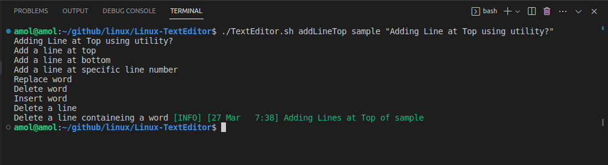
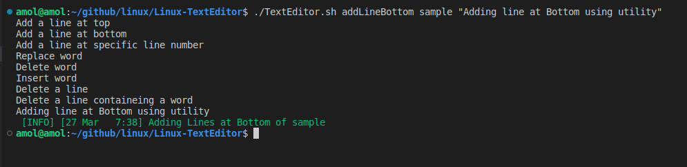
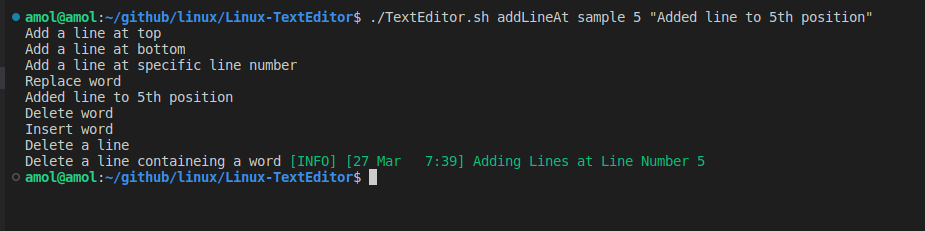
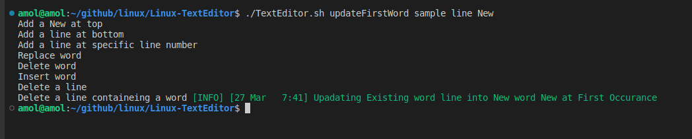
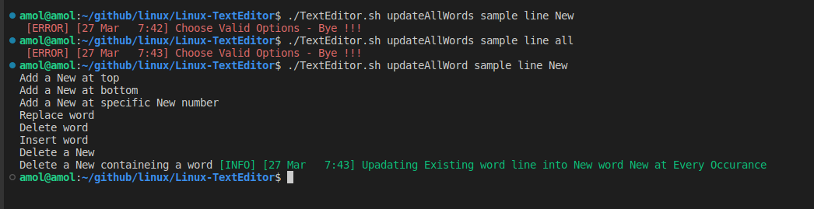
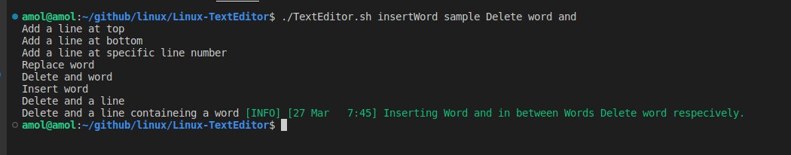
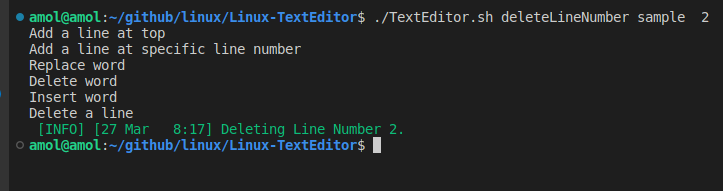
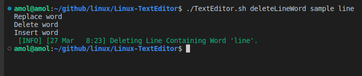

# **Linux TextEditor**


## **<u>Create a utility(TextEditor.sh) that will be able to</u>** :

 - Add a line at top
 - Add a line at bottom
 - Add a line at specific line number
 - Replace word
 - Delete word
 - Insert word
 - Delete a line
 - Delete a line containing a word

```
./TextEditor.sh addLineTop <file> <line>
./TextEditor.sh addLineBottom <file> <line>
./TextEditor.sh addLineAt <file> <linenumber> <line>
./TextEditor.sh updateFirstWord <file> <word>
./TextEditor.sh updateAllWord <file> <word>
./TextEditor.sh insertWord <file> <word1> <word2> <word to be inserted>
./TextEditor.sh deleteLineNumber <file> <line no>
./TextEditor.sh deleteLineWord <file> <word>
```








